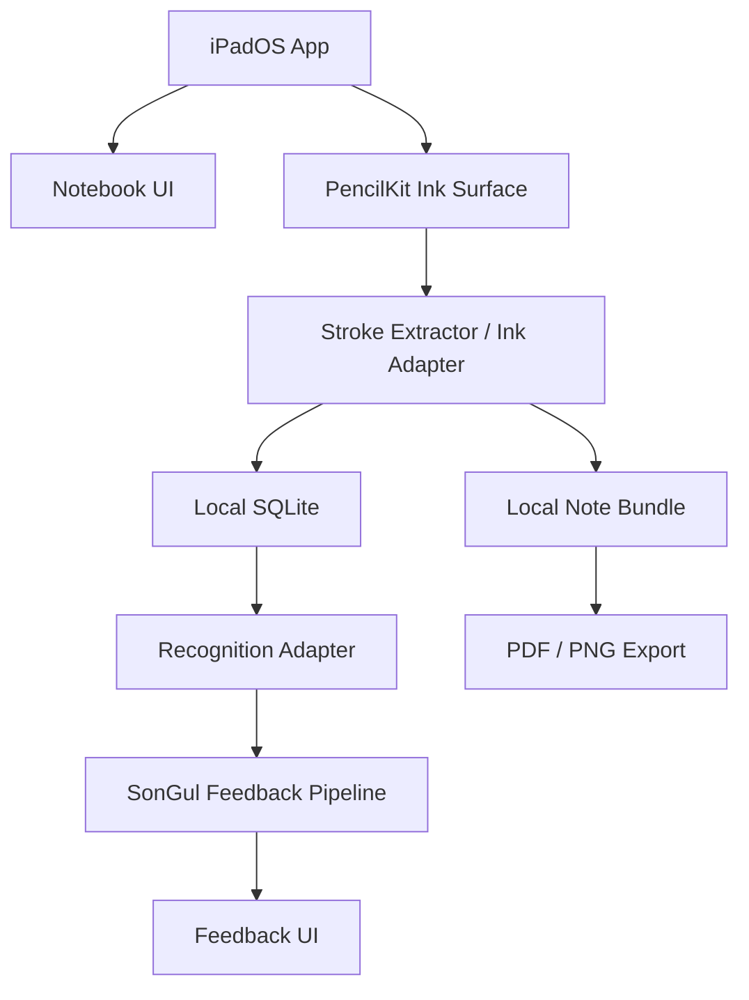
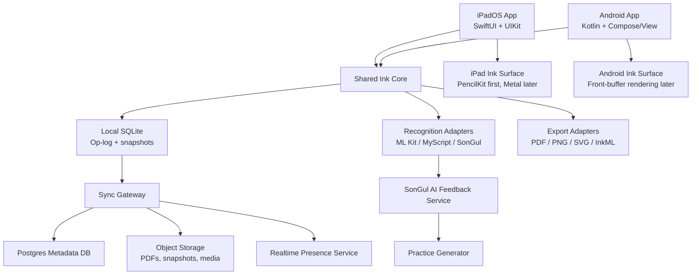

# SonGul Product Plan

## 1. Product Definition

### 1.1 Product Name

**SonGul Note**

A tablet-first handwriting note-taking app designed as the base product layer for SonGul. The app should feel like a serious handwriting notebook first, then add Korean learner intelligence on top.

### 1.2 Product Vision

Build a handwriting-first tablet note app where Korean learners can write naturally with a stylus, organize their notes, annotate PDFs, search handwritten content, and receive targeted feedback on Korean handwriting, spacing, grammar, and written expression.

### 1.3 Core Differentiation

Most note apps optimize note capture. SonGul should optimize **handwritten Korean learning**.

The product should combine:

- Low-latency stylus writing.
- Notebook and page-based note organization.
- PDF annotation for worksheets, lecture slides, and assignments.
- Handwriting recognition and handwritten search.
- Korean learner feedback for handwriting shape, spacing, grammar, particles, and naturalness.
- Practice-mode generation based on the user's recurring mistakes.

### 1.4 Target Users

Primary users:

- Korean language learners using tablets.
- International students studying Korean in university settings.
- TOPIK learners practicing handwritten Korean answers.
- Learners who prefer handwriting over typing.

Secondary users:

- Korean teachers reviewing student handwriting.
- Language institutes assigning handwritten practice.
- Students annotating Korean PDFs, textbooks, worksheets, and lecture slides.

### 1.5 Product Principle

SonGul should not start as a generic AI app. It should start as a **reliable note-taking app**. AI feedback becomes valuable only after the writing surface, storage, export, and basic note workflow are stable.

---

## 2. MVP Scope

### 2.1 MVP Goal

The first MVP should prove that SonGul can be used as a real handwriting notebook for Korean learners.

A user should be able to:

1. Create a notebook.
2. Choose a page template.
3. Write smoothly with a stylus.
4. Add, delete, and reorder pages.
5. Save notes locally.
6. Import a PDF worksheet.
7. Annotate the PDF.
8. Export the result as PDF or PNG.
9. Run basic Korean handwriting/spacing feedback on selected content.

### 2.2 MVP Platform

Recommended order:

1. **iPadOS first** for fastest high-quality handwriting prototype.
2. **Android/Samsung tablet second** because S Pen users are important for the target market.
3. **Web viewer later**, not as the first handwriting editor.

### 2.3 MVP Include

| Area | MVP Include |
|---|---|
| Notebook | Create, rename, delete notebooks |
| Pages | Add, delete, duplicate, reorder pages |
| Ink | Pen, highlighter, eraser, undo, redo |
| Templates | Blank, lined, grid, Korean practice sheet, TOPIK essay sheet |
| Storage | Local SQLite/file-based save and load |
| PDF | Import PDF, annotate, export annotated PDF |
| Recognition | Basic handwriting recognition experiment |
| SonGul AI | Feedback panel mock + first Korean correction pipeline |
| Export | PDF, PNG, internal `.songul` bundle |

### 2.4 MVP Exclude

Do not build these in the first version:

- Realtime collaboration.
- Full cloud sync.
- Marketplace.
- Infinite canvas.
- Audio recording.
- AI flashcards/quizzes.
- Full teacher dashboard.
- Subscription/payment.
- Web editor.
- Custom Metal/Skia renderer unless PencilKit becomes limiting.

---

## 3. Product Milestones

## Milestone 0 — Product Specification

### Goal

Define the product tightly enough that development can start without feature drift.

### Tasks

- Write `PRODUCT_SPEC.md`.
- Write `MVP_FEATURES.md`.
- Define the notebook/page/stroke data model.
- Draw wireframes for the core screens.
- Decide the first platform: iPadOS or Android.
- Define the first Korean feedback types.

### Required Screens

- Library screen.
- Folder/notebook screen.
- Notebook editor.
- Page thumbnail sidebar.
- Pen toolbar.
- Lasso/edit menu.
- Korean feedback panel.
- Export/share screen.
- Settings screen.

### Deliverables

- Product requirements document.
- Feature priority table.
- Wireframes.
- Initial data model.
- Technical architecture sketch.

### Definition of Done

The team can explain exactly what v0.1, v0.5, and v1.0 contain.

---

## Milestone 1 — App Shell

### Goal

Build the non-inking app structure first.

### Recommended Stack

For iPadOS:

- SwiftUI for normal UI.
- UIKit bridge where needed.
- PencilKit for the first writing canvas.
- SQLite for local metadata.
- Local file storage for note bundles and attachments.

For Android later:

- Kotlin.
- Jetpack Compose for normal UI.
- Native View or low-latency drawing surface for the writing canvas.
- SQLite/Room for local metadata.
- Local file storage for note bundles and attachments.

### Tasks

- Create project.
- Build app navigation.
- Build library screen.
- Build notebook creation flow.
- Build notebook open/close flow.
- Build page editor screen without real ink.
- Build page thumbnail sidebar.
- Build toolbar shell.
- Build settings screen.

### Deliverables

- Running tablet app shell.
- Library → notebook → editor navigation.
- Notebook and page CRUD.
- Empty page editor.

### Definition of Done

A user can create a notebook, open it, create pages, reorder pages, and return to the library.

---

## Milestone 2 — Core Ink Engine v0

### Goal

Implement the first usable handwriting surface.

### Technical Direction

For iPadOS MVP, use PencilKit first because it gives a strong baseline quickly. However, store enough structured ink data so SonGul is not locked into PencilKit forever.

Long-term direction:

- Custom ink engine.
- Predicted ink overlay.
- Committed ink layer.
- Vector stroke storage.
- Metal on iPadOS.
- Android front-buffer rendering on Android.

### Stroke Data Requirements

Each stroke should preserve:

- Stroke ID.
- Page ID.
- Author/device ID.
- x/y points.
- Timestamp or delta time.
- Pressure.
- Tilt.
- Azimuth/orientation where available.
- Brush type.
- Brush width.
- Color.
- Deleted/tombstone status.

### Tasks

- Add writing canvas.
- Add pen tool.
- Add highlighter tool.
- Add eraser tool.
- Add undo/redo.
- Store strokes locally.
- Reload strokes after app restart.
- Add basic palm rejection configuration where available.
- Add two-finger pan and pinch zoom.
- Add page background rendering.

### Deliverables

- Smooth writing canvas.
- Pen/highlighter/eraser.
- Undo/redo.
- Stroke persistence.
- Page reload.

### Definition of Done

A user can write 10 pages of notes, close the app, reopen it, and see the same notes without corruption.

---

## Milestone 3 — Local Storage and Op-Log

### Goal

Make the app reliable offline before adding cloud sync.

### Local Data Model

```text
Workspace
└── Folder
    └── Document / Notebook
        └── Page
            ├── Stroke[]
            ├── Attachment[]
            ├── TextBlock[]
            ├── RecognitionResult[]
            └── FeedbackResult[]
```

### Suggested Tables

```text
documents
pages
strokes
stroke_points
attachments
op_log
snapshots
recognition_results
feedback_results
settings
```

### Operation Types

```text
CREATE_DOCUMENT
UPDATE_DOCUMENT
DELETE_DOCUMENT
CREATE_PAGE
DELETE_PAGE
REORDER_PAGE
ADD_STROKE
DELETE_STROKE
TRANSFORM_STROKE
ADD_ATTACHMENT
DELETE_ATTACHMENT
ADD_RECOGNITION_RESULT
ADD_FEEDBACK_RESULT
```

### Tasks

- Implement SQLite schema.
- Implement local file bundle format.
- Implement append-only operation log.
- Implement snapshot creation.
- Implement crash recovery.
- Implement storage migration system.
- Implement backup/export of raw `.songul` note bundle.

### Deliverables

- Local database.
- Operation log.
- Snapshot system.
- Crash recovery.
- Internal note bundle export.

### Definition of Done

Force-close the app while writing. Reopen it. The notebook should recover cleanly.

---

## Milestone 4 — Notebook Editor Features

### Goal

Turn the handwriting canvas into a practical note-taking editor.

### Required Features

- Page thumbnails.
- Page templates.
- Lasso selection.
- Move selected strokes.
- Resize selected strokes.
- Delete selected strokes.
- Copy/paste strokes.
- Basic shape assist.
- Image insert.
- Text box insert.
- Toolbar customization.

### Template Set

MVP templates:

- Blank.
- Lined.
- Grid.
- Dotted.
- Korean square practice grid.
- TOPIK essay template.
- Cornell note template.

### Gesture Rules

Recommended defaults:

- Stylus writes.
- Finger scrolls or pans.
- Two fingers pan/zoom.
- Double tap undo.
- Long press opens selection menu.
- Android/S Pen button temporarily switches to eraser if possible.

### Tasks

- Build template renderer.
- Build page thumbnail cache.
- Build lasso hit-testing.
- Build selected stroke transform.
- Build copy/paste.
- Build basic shape detection.
- Build image insert.
- Build text box insert.
- Build configurable toolbar.

### Deliverables

- Practical notebook editor.
- Lasso and transform tools.
- Template system.
- Page thumbnails.
- Basic object insertion.

### Definition of Done

A user can take a real 30-minute class note session using SonGul without needing Goodnotes, Notability, or Samsung Notes.

---

## Milestone 5 — PDF Import, Annotation, and Export

### Goal

Support worksheets, textbooks, lecture slides, assignments, and teacher-provided PDFs.

### Architecture

Keep the original PDF and user ink separate.

```text
PDF attachment = immutable background source
Ink strokes = editable overlay
Export = PDF background + ink overlay rendered together
```

### Tasks

- Import PDF from file picker.
- Convert each PDF page into a notebook page background.
- Render PDF page in editor.
- Let user write/highlight over PDF.
- Add blank page between PDF pages.
- Export annotated PDF.
- Export current page as PNG.
- Export whole notebook as PDF.

### Deliverables

- PDF import.
- PDF annotation.
- PDF export.
- PNG export.

### Definition of Done

A user can import a Korean worksheet PDF, write answers on it, and export a clean annotated PDF.

---

## Milestone 6 — Handwriting Recognition and Search

### Goal

Make handwriting searchable and partially convertible.

### Recognition Strategy

Start with an adapter layer so the recognition provider can change later.

Possible providers:

- ML Kit Digital Ink Recognition for low-cost experimentation.
- MyScript iink SDK if recognition becomes a core premium feature.
- Custom SonGul model later for Korean learner handwriting.

### Recognition Interface

```text
recognizeSelection(strokes, language)
recognizePage(pageId, language)
recognizeNotebook(documentId, language)
```

### Recognition Output

Store:

- Recognized text.
- Language.
- Confidence.
- Stroke IDs.
- Bounding box.
- Page ID.
- Timestamp.
- Provider name/version.

### Tasks

- Build recognition adapter interface.
- Add recognition provider mock.
- Integrate first real recognition provider.
- Add page-level recognition job.
- Add selected-stroke recognition.
- Store recognition results locally.
- Build handwriting search index.
- Jump from search result to page/stroke area.
- Build select-and-convert-to-text flow.

### Deliverables

- Handwriting recognition prototype.
- Handwritten note search.
- Select and convert to text.
- Recognition benchmark samples.

### Definition of Done

A user writes Korean notes by hand, searches a Korean word later, and SonGul opens the correct page area.

---

## Milestone 7 — SonGul Korean Feedback Layer

### Goal

Add the product feature that makes SonGul different from generic note apps.

### Feedback Types for MVP

Start with four categories:

1. **Handwriting shape feedback**
   - Character balance.
   - Syllable block proportion.
   - 받침 clarity.
   - Confusable Hangul shapes.

2. **Spacing feedback**
   - 붙여쓰기/띄어쓰기 errors.
   - Common learner spacing mistakes.
   - TOPIK-style sentence spacing.

3. **Grammar feedback**
   - Particle errors.
   - Verb/adjective endings.
   - Tense/aspect/politeness mismatch.

4. **Naturalness feedback**
   - Awkward learner expression.
   - Lexical choice.
   - Register mismatch.

### Feedback Pipeline

```text
User handwriting
→ Stroke data
→ Page/selection image render
→ Handwriting recognition/OCR
→ Korean text normalization
→ Error detection
→ Feedback generation
→ Bounding box alignment
→ UI explanation panel
→ Practice recommendation
```

### API Design

```http
POST /feedback/analyze-selection
POST /feedback/analyze-page
POST /feedback/generate-practice
GET  /feedback/history/:documentId
```

### Feedback Result Schema

```json
{
  "feedback_id": "fb_001",
  "document_id": "doc_001",
  "page_id": "page_001",
  "type": "spacing | grammar | handwriting_shape | naturalness",
  "severity": "low | medium | high",
  "original": "이번주",
  "suggestion": "이번 주",
  "explanation": "'이번 주'는 관형사 '이번'과 명사 '주'가 결합한 표현이므로 띄어 씁니다.",
  "bbox": { "x": 100, "y": 240, "w": 80, "h": 40 },
  "stroke_ids": ["stroke_001", "stroke_002"]
}
```

### Tasks

- Build feedback side panel.
- Build feedback highlight overlay.
- Build feedback result schema.
- Implement mock feedback response.
- Implement first Korean spacing checker.
- Implement first grammar checker.
- Implement first handwriting-shape feedback prototype.
- Connect feedback to selected handwriting.
- Save feedback history.
- Generate practice recommendations.

### Deliverables

- Feedback panel.
- Highlight overlay.
- Korean spacing feedback v0.
- Korean grammar feedback v0.
- Handwriting-shape feedback v0.
- Practice recommendation v0.

### Definition of Done

A learner writes a Korean sentence by hand, selects it, taps “Analyze,” and receives useful feedback with visible highlights and explanations.

---

## Milestone 8 — Practice Mode

### Goal

Turn feedback into improvement.

### Practice Modes

- Trace Hangul syllables.
- Copy sentence.
- Rewrite corrected sentence.
- Practice frequent spacing mistakes.
- Practice frequent grammar mistakes.
- TOPIK short-answer practice.

### Tasks

- Build practice notebook type.
- Generate practice page from feedback history.
- Add tracing guides.
- Compare user handwriting against target.
- Track repeated mistakes.
- Show progress dashboard.

### Deliverables

- Practice mode.
- Generated practice pages.
- Mistake history.
- Progress dashboard.

### Definition of Done

A user can review their top recurring mistakes and open a generated practice page targeting those mistakes.

---

## Milestone 9 — Cloud Sync and Account System

### Goal

Add cloud backup and cross-device sync after local storage is stable.

### Recommended Backend Architecture

```text
Mobile App
→ Local SQLite + note bundle storage
→ Delta sync client
→ Sync gateway API
→ Postgres metadata DB
→ Object storage for PDFs, media, snapshots
→ Realtime service for presence/cursors later
```

### Backend Components

- Auth service.
- Sync gateway.
- Metadata API.
- Object storage service.
- Background workers.
- Realtime/presence service later.

### Suggested Stack

Option A, pragmatic:

- Supabase Auth.
- Postgres.
- Supabase Storage or S3-compatible storage.
- Supabase Realtime for presence later.
- Custom sync logic.

Option B, AWS-heavy:

- Cognito.
- AppSync.
- DynamoDB/Postgres.
- S3.
- Lambda workers.

Option C, Firebase-heavy:

- Firebase Auth.
- Firestore for metadata only.
- Cloud Storage for note bundles.
- Custom operation-level sync for strokes.

### Important Rule

Do not sync entire notebook documents by last-write-wins. Sync operation deltas and snapshots.

### Sync Conflict Rules

| Operation | Conflict Strategy |
|---|---|
| Add stroke | Merge |
| Delete stroke | Tombstone |
| Move stroke | Transform op; resolve by logical clock/device order initially |
| Add page | Merge |
| Delete page | Tombstone page; preserve recoverability |
| Reorder page | CRDT list later; simple server order for MVP |
| Feedback result | Append-only |

### Tasks

- Add user accounts.
- Add device IDs.
- Add cloud metadata schema.
- Add operation upload.
- Add operation download.
- Add snapshot upload/download.
- Add attachment upload/download.
- Add conflict handling.
- Add sync status UI.
- Add manual backup.

### Deliverables

- Login.
- Cloud backup.
- Cross-device sync v0.
- Sync status indicator.
- Conflict-safe operation sync.

### Definition of Done

A user writes on one device, opens another device, and sees the same notebook. If both devices write offline, both sets of strokes appear after sync.

---

## Milestone 10 — Collaboration

### Goal

Add shared notebooks after sync is stable.

### Collaboration Features

- Share notebook by invite/link.
- View-only and edit permissions.
- Live cursor/presence.
- Page-level active user indicator.
- Comments.
- Shared feedback notes for teacher/student review.

### Tasks

- Add collaborator table.
- Add permission model.
- Add share dialog.
- Add realtime presence service.
- Add live cursor rendering.
- Add comments.
- Add teacher review mode.

### Deliverables

- Shared notebooks.
- Permissions.
- Presence.
- Comments.
- Teacher feedback workflow.

### Definition of Done

A teacher can open a student's shared notebook, add comments or corrections, and the student can see them.

---

## Milestone 11 — Performance and Production Hardening

### Goal

Make the app reliable under real tablet usage.

### Performance Targets

Initial practical targets:

- Writing feels instant on current iPad/Samsung tablets.
- Notebook opens in under 1 second for small notebooks.
- Large PDF notebook remains scrollable.
- Page switching does not block the UI.
- Search returns useful results quickly.
- No data loss on force close.

### Performance Techniques

- Lazy-load pages.
- Cache thumbnails.
- Keep nearby pages hot.
- Use snapshots.
- Compact old operation logs.
- Store strokes as vectors, not full-page bitmaps.
- Render only visible/near-visible pages.
- Keep predicted ink separate from committed ink.
- Use background jobs for recognition.

### Testing Strategy

Unit tests:

- Stroke model.
- Op-log.
- Undo/redo.
- Snapshot reconstruction.
- Sync merge.
- Feedback result parsing.

Replay tests:

- Record stylus traces.
- Replay traces after engine changes.
- Compare rendered output.

Device tests:

- iPad + Apple Pencil.
- Samsung Galaxy Tab + S Pen.
- Lower-end Android tablet.
- Different refresh rates.
- Offline/online switching.
- Battery saver mode.

### Observability

- Crash reporting.
- Performance traces.
- Sync failure logs.
- Recognition latency logs.
- Feedback API latency logs.

### Deliverables

- Automated test suite.
- Device test matrix.
- Crash reporting.
- Performance dashboard.
- Release checklist.

### Definition of Done

The app can be used by 10 real beta testers for a week without note corruption or major writing failures.

---

## 4. Suggested Repository Structure

```text
songul/
  apps/
    ipad/
      SonGul.xcodeproj
      Sources/
      Tests/
    android/
      app/
      core/
      tests/
    web-viewer/
      src/
  packages/
    ink-core/
      src/
      tests/
      bindings/
        swift/
        kotlin/
    recognition/
      mlkit/
      myscript/
      mock/
    sync-core/
      src/
      tests/
    songul-ai/
      handwriting-feedback/
      korean-error-feedback/
      practice-generator/
  backend/
    api/
    sync-gateway/
    realtime/
    workers/
    migrations/
  docs/
    PRODUCT_SPEC.md
    PLAN.md
    ARCHITECTURE.md
    DATA_MODEL.md
    INK_ENGINE.md
    SYNC_PROTOCOL.md
    ROADMAP.md
```

---

## 5. Technical Architecture

### 5.1 Recommended MVP Architecture



### 5.2 Recommended Production Architecture



---

## 6. Development Order

### Phase 1 — Prototype

Build:

- iPadOS app shell.
- Notebook/page system.
- PencilKit writing canvas.
- Local save/load.
- Pen/highlighter/eraser.
- Basic templates.

Do not build:

- Cloud sync.
- Collaboration.
- Marketplace.
- Full AI.

### Phase 2 — Usable MVP

Build:

- Lasso.
- Undo/redo.
- PDF import/export.
- Page thumbnails.
- Recognition adapter.
- Basic handwritten search.
- Feedback panel mock.

### Phase 3 — SonGul Differentiation

Build:

- Korean spacing feedback.
- Korean grammar feedback.
- Handwriting-shape feedback.
- Practice mode.
- Mistake dashboard.

### Phase 4 — Cloud Product

Build:

- Auth.
- Cloud backup.
- Cross-device sync.
- Sync conflict handling.
- Share links.

### Phase 5 — Production

Build:

- Custom rendering path if needed.
- Android/Samsung tablet version.
- Teacher/student workflow.
- Realtime collaboration.
- Payment/subscription.
- App Store / Play Store release.

---

## 7. Engineering Priorities

### Priority 1 — Writing Must Feel Good

Bad ink kills the product. The first version should prioritize writing feel, page stability, and no data loss over AI complexity.

### Priority 2 — Store Ink Properly

Do not store notes as screenshots. Store vector strokes with metadata. This enables search, feedback, replay, compression, editing, and sync.

### Priority 3 — Local First

The app should work fully offline. Cloud sync should enhance the app, not be required for note-taking.

### Priority 4 — SonGul AI Should Be Grounded in User Strokes

Feedback should use both:

- Rendered image/OCR output.
- Original stroke data.

This lets SonGul detect not only text errors but handwriting-shape issues.

### Priority 5 — Build Recognition as an Adapter

Do not hardcode one recognition provider. Start with ML Kit or MyScript, but keep the provider swappable.

---

## 8. Risk Register

| Risk | Impact | Mitigation |
|---|---:|---|
| Ink latency feels worse than Goodnotes/Notability | Very high | Start native; use PencilKit first; test on real devices |
| Storage corruption | Very high | Use op-log, snapshots, crash recovery, tests |
| Korean handwriting recognition is weak | High | Build benchmark set; test ML Kit/MyScript/custom models |
| AI feedback is too vague | High | Use span/bounding-box feedback with concrete correction reasons |
| PDF rendering/export becomes complex | Medium | Keep PDF background and ink overlay separate |
| Sync conflicts corrupt notes | Very high | Use operation-level sync, not whole-document overwrites |
| Scope creep | High | Enforce MVP include/exclude list |
| Android stylus behavior varies by device | Medium | Maintain real device test matrix |

---

## 9. First 30-Day Build Plan

### Week 1 — Product and App Skeleton

- Finalize `PRODUCT_SPEC.md`.
- Finalize `MVP_FEATURES.md`.
- Create iPadOS project.
- Build library screen.
- Build notebook/page models.
- Build editor shell.

### Week 2 — First Writing Canvas

- Add PencilKit canvas.
- Add pen/highlighter/eraser.
- Save/load canvas data.
- Add basic templates.
- Add undo/redo.

### Week 3 — Notebook Usability

- Add page thumbnails.
- Add page reorder/delete/duplicate.
- Add local file bundle export.
- Add crash recovery test.
- Add basic lasso if feasible.

### Week 4 — PDF and SonGul Feedback Mock

- Add PDF import.
- Add PDF annotation.
- Add PDF export.
- Add feedback side panel.
- Add mock Korean correction response.
- Prepare recognition benchmark samples.

### End-of-Month Demo

The demo should show:

1. Create Korean practice notebook.
2. Write with Apple Pencil.
3. Add pages.
4. Import Korean worksheet PDF.
5. Annotate PDF.
6. Export PDF.
7. Select handwritten Korean sentence.
8. Show mock SonGul feedback panel.

---

## 10. Version Roadmap

### v0.1 — Local Handwriting Notebook

- Notebook creation.
- Page creation.
- Basic ink.
- Templates.
- Local save/load.

### v0.2 — Practical Student Notebook

- Lasso.
- Page thumbnails.
- PDF import/export.
- PNG export.
- Better toolbar.

### v0.3 — Recognition Prototype

- Recognition adapter.
- Korean handwriting recognition test.
- Handwritten search.
- Convert selected handwriting to text.

### v0.4 — SonGul Feedback MVP

- Korean spacing feedback.
- Grammar feedback.
- Handwriting-shape feedback.
- Feedback overlay.
- Feedback history.

### v0.5 — Practice Mode

- Practice page generator.
- Mistake dashboard.
- Korean learner progress tracking.

### v0.8 — Cloud Backup

- Login.
- Cloud backup.
- Cross-device sync.
- Sync status UI.

### v1.0 — Public Beta

- Stable writing.
- Stable storage.
- PDF workflow.
- Recognition/search.
- Korean feedback.
- Practice mode.
- Cloud backup.
- Beta analytics and crash reporting.

---

## 11. Immediate Next Actions

1. Create a new repository named `songul-note`.
2. Add `docs/PRODUCT_SPEC.md` and this `docs/PLAN.md`.
3. Build the iPadOS app shell.
4. Implement local notebook/page CRUD.
5. Add PencilKit writing canvas.
6. Store strokes or drawing data locally.
7. Add Korean practice templates.
8. Build feedback panel mock.
9. Test with real Apple Pencil/iPad.
10. Start recognition benchmark with Korean learner handwriting samples.

